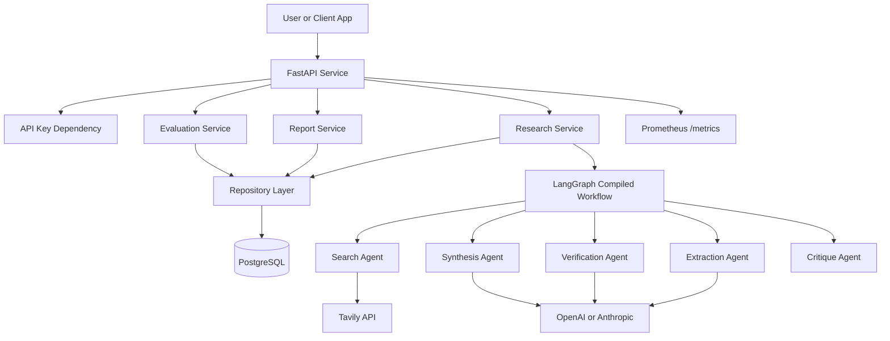
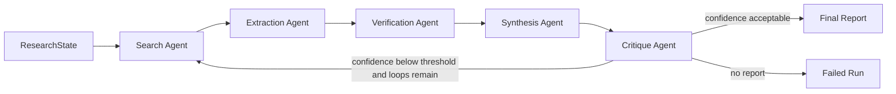
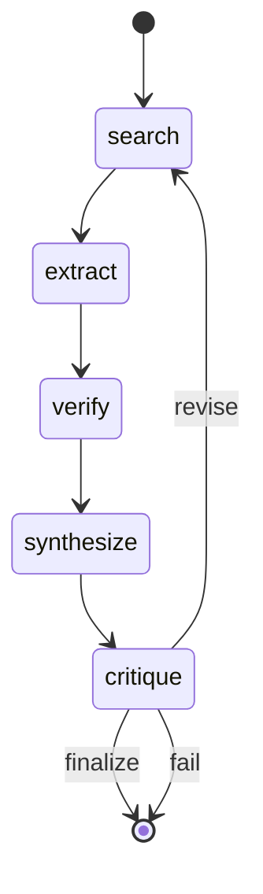
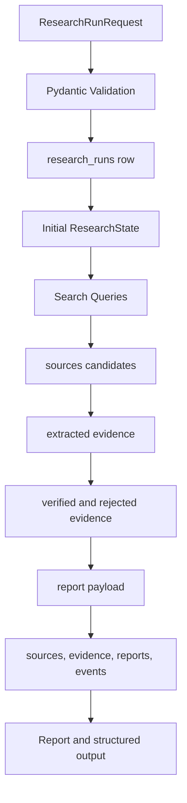
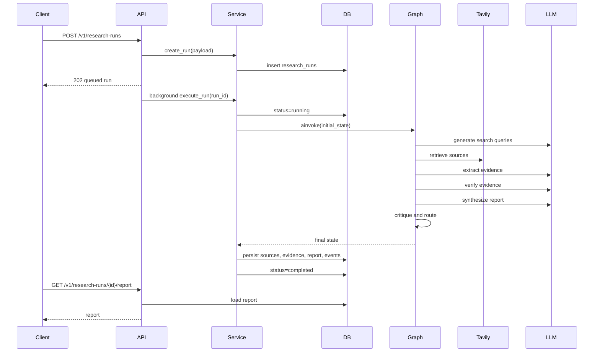

# Section 2 - System Architecture

## High-Level Architecture

The system uses FastAPI as the service boundary, PostgreSQL as the durable system of record, and LangGraph as the orchestration layer. Each agent performs one research responsibility and passes structured state to the next node.

## Component Architecture

### API Layer

The API layer owns request validation, response serialization, authentication hooks, error handling, and route composition. It does not contain graph logic or persistence logic.

Files:

- `backend/research_orchestrator/main.py`
- `backend/research_orchestrator/api/schemas.py`
- `backend/research_orchestrator/api/routes/research.py`
- `backend/research_orchestrator/api/routes/reports.py`
- `backend/research_orchestrator/api/routes/evaluations.py`

### Service Layer

The service layer owns use cases. It creates runs, executes the graph, stores results, retrieves reports, and runs evaluations.

Files:

- `backend/research_orchestrator/services/research_service.py`
- `backend/research_orchestrator/services/report_service.py`
- `backend/research_orchestrator/services/evaluation_service.py`

### Agent Layer

The agent layer owns LangGraph state, prompts, tools, node behavior, scoring, and topology.

Files:

- `backend/research_orchestrator/agents/state.py`
- `backend/research_orchestrator/agents/prompts.py`
- `backend/research_orchestrator/agents/tools.py`
- `backend/research_orchestrator/agents/nodes.py`
- `backend/research_orchestrator/agents/graph.py`
- `backend/research_orchestrator/agents/scoring.py`
- `backend/research_orchestrator/agents/providers.py`

### Database Layer

The database layer owns SQLAlchemy models and repository methods. PostgreSQL stores durable state for auditability.

Files:

- `backend/research_orchestrator/database/models.py`
- `backend/research_orchestrator/database/repositories.py`
- `database/migrations/001_init.sql`

### Evaluation Layer

The evaluation layer scores generated reports for hallucination resistance, citation accuracy, and report quality.

Files:

- `backend/research_orchestrator/evaluation/metrics.py`
- `backend/research_orchestrator/evaluation/datasets.py`
- `backend/research_orchestrator/evaluation/runner.py`

## Agent Architecture

Each agent reads and writes a shared typed state:

- Search writes `search_queries` and `raw_sources`.
- Extraction writes `extracted_evidence`.
- Verification writes `verified_evidence` and `rejected_evidence`.
- Synthesis writes `report` and `confidence_score`.
- Critique writes `critique`, `next_action`, and final `status`.

## LangGraph State Graph

The graph is intentionally linear until critique. This prevents hidden cross-agent cycles and makes run inspection easier. The only loop is controlled by confidence threshold and `max_graph_iterations`.

## Data Flow Diagram

## Sequence Diagram

## Service Boundaries

- FastAPI boundary: HTTP contract, auth, validation, serialization.
- Service boundary: application use cases and orchestration.
- Repository boundary: persistence and query shape.
- Agent boundary: graph state transitions and AI behavior.
- Provider boundary: OpenAI, Anthropic, deterministic model adapters.
- Tool boundary: Tavily search abstraction.
- Evaluation boundary: report scoring independent of graph execution.

## Failure Handling Design

- Missing credentials: deterministic mode supports tests and offline review; production credentials are configured through environment variables.
- Search failure: the search tool returns deterministic fallback only when Tavily is not configured; provider exceptions are captured by service execution and mark the run failed.
- LLM JSON failure: nodes fall back to deterministic extraction or query generation where possible.
- Low confidence: critique routes back to search until `max_graph_iterations` is reached.
- Graph non-output failure: service marks the run failed if no report is produced.
- Persistence failure: transaction rollback occurs through SQLAlchemy session behavior; failed API calls surface structured error responses.
- API auth failure: missing or invalid API key returns a 401 error.
- Unexpected exception: registered exception handler returns a structured 500 payload.

## Architectural Decisions

### LangGraph for Orchestration

Decision: use LangGraph instead of a hand-rolled workflow.

Reason: LangGraph makes stateful agent orchestration explicit, reviewable, testable, and extensible. It supports conditional routing, graph compilation, and node-level separation.

Tradeoff: a graph framework adds dependency surface area and requires disciplined state design.

### Specialized Agents

Decision: split search, extraction, verification, synthesis, and critique into distinct nodes.

Reason: research quality improves when source discovery, evidence extraction, verification, and writing are separable. It also makes failure modes inspectable.

Tradeoff: more latency and more moving parts than a single prompt.

### PostgreSQL System of Record

Decision: store runs, sources, evidence, reports, events, and evaluations in PostgreSQL.

Reason: reports need audit trails, relational queries, and durable state.

Tradeoff: local setup is heavier than an in-memory or document-only implementation.

### Confidence-Gated Loop

Decision: allow the critique agent to route back to search when confidence is below threshold.

Reason: low-confidence reports should improve source coverage before delivery.

Tradeoff: additional loops increase cost and latency.

### Deterministic Provider

Decision: include deterministic mode.

Reason: CI, local tests, portfolio reviewers, and offline demos need a working path without paid APIs.

Tradeoff: deterministic mode is less capable than real provider execution and is labeled as a test path.

## Alternatives Considered

### Single LLM Prompt

Rejected because it hides intermediate evidence, cannot reliably validate citations, and is hard to test.

### Agent Framework Without Graph State

Rejected because ad hoc agent chaining makes retries, loops, and traceability harder to reason about.

### Vector Database First

Deferred from the core architecture because the primary use case is live research with source tracking, not retrieval over a fixed corpus. A vector store can be added for report memory and source recall.

### NoSQL Database

Rejected because the core entities have clear relationships and need constraints: runs, sources, evidence, reports, events, and evaluations.

### Fully Async Worker Queue

Considered for production scale. The current repository keeps execution in FastAPI background tasks to remain locally runnable. The service boundary is already shaped so a Celery, Dramatiq, or Temporal worker can take over execution without changing API contracts.

