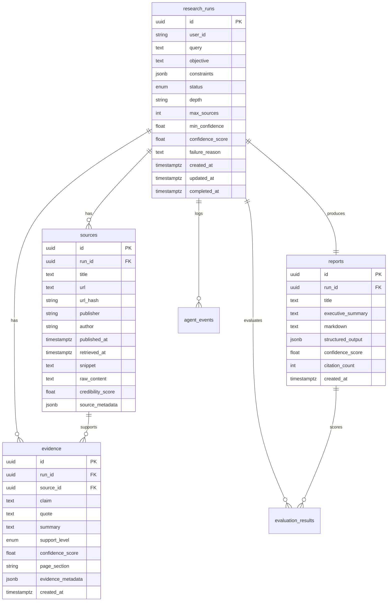

# Section 4 - Database Design

## ER Diagram Description



## Relationships

- `research_runs` is the parent table for every workflow execution.
- `sources` stores retrieved source candidates and credibility scores.
- `evidence` stores extracted and verified atomic claims. Evidence can remain attached to a run even if a source is removed, because `source_id` uses `ON DELETE SET NULL`.
- `reports` stores one final report per run through a unique `run_id`.
- `agent_events` stores trace events for auditability and debugging.
- `evaluation_results` stores quality metrics for report payloads and persisted reports.

## Indexes

- `ix_research_runs_status_created_at`: queue and status dashboards.
- `ix_research_runs_user_id_created_at`: user run history.
- `ix_sources_run_id`: source retrieval by run.
- `ix_sources_url_hash`: deduplication and source lookup.
- `ix_sources_metadata_gin`: metadata inspection.
- `ix_evidence_run_id`: evidence retrieval by run.
- `ix_evidence_source_id`: evidence retrieval by source.
- `ix_evidence_support_level`: verified versus rejected filtering.
- `ix_reports_confidence_score`: confidence-based analysis.
- `ix_reports_structured_output_gin`: structured output queries.
- `ix_agent_events_run_id`: run event timeline.
- `ix_evaluation_results_metric`: evaluation dashboards.

## Constraints

- `max_sources` must be between 3 and 50.
- `min_confidence`, `confidence_score`, `credibility_score`, and evaluation `score` must be between 0 and 1.
- Each run can have only one final report.
- Each run stores each source URL once through `(run_id, url_hash)`.
- Deleting a run cascades to sources, evidence, reports, events, and evaluations.

## Complete SQL

The complete executable SQL is stored in `database/migrations/001_init.sql`. It defines extensions, enums, tables, constraints, indexes, and the `updated_at` trigger.

```sql
CREATE EXTENSION IF NOT EXISTS pgcrypto;

CREATE TYPE run_status AS ENUM ('queued', 'running', 'completed', 'failed');
CREATE TYPE support_level AS ENUM ('supports', 'partially_supports', 'contradicts', 'insufficient');

CREATE TABLE research_runs (
    id UUID PRIMARY KEY DEFAULT gen_random_uuid(),
    user_id VARCHAR(128),
    query TEXT NOT NULL,
    objective TEXT,
    constraints JSONB NOT NULL DEFAULT '{}'::jsonb,
    status run_status NOT NULL DEFAULT 'queued',
    depth VARCHAR(32) NOT NULL DEFAULT 'advanced',
    max_sources INTEGER NOT NULL DEFAULT 12 CHECK (max_sources BETWEEN 3 AND 50),
    min_confidence DOUBLE PRECISION NOT NULL DEFAULT 0.72 CHECK (min_confidence >= 0 AND min_confidence <= 1),
    confidence_score DOUBLE PRECISION CHECK (confidence_score IS NULL OR confidence_score BETWEEN 0 AND 1),
    failure_reason TEXT,
    created_at TIMESTAMPTZ NOT NULL DEFAULT now(),
    updated_at TIMESTAMPTZ NOT NULL DEFAULT now(),
    completed_at TIMESTAMPTZ
);

CREATE TABLE sources (
    id UUID PRIMARY KEY DEFAULT gen_random_uuid(),
    run_id UUID NOT NULL REFERENCES research_runs(id) ON DELETE CASCADE,
    title TEXT NOT NULL,
    url TEXT NOT NULL,
    url_hash VARCHAR(64) NOT NULL,
    publisher VARCHAR(256),
    author VARCHAR(256),
    published_at TIMESTAMPTZ,
    retrieved_at TIMESTAMPTZ NOT NULL DEFAULT now(),
    snippet TEXT,
    raw_content TEXT,
    credibility_score DOUBLE PRECISION NOT NULL DEFAULT 0.5 CHECK (credibility_score BETWEEN 0 AND 1),
    source_metadata JSONB NOT NULL DEFAULT '{}'::jsonb,
    CONSTRAINT uq_sources_run_url_hash UNIQUE (run_id, url_hash)
);

CREATE TABLE evidence (
    id UUID PRIMARY KEY DEFAULT gen_random_uuid(),
    run_id UUID NOT NULL REFERENCES research_runs(id) ON DELETE CASCADE,
    source_id UUID REFERENCES sources(id) ON DELETE SET NULL,
    claim TEXT NOT NULL,
    quote TEXT,
    summary TEXT NOT NULL,
    support_level support_level NOT NULL DEFAULT 'insufficient',
    confidence_score DOUBLE PRECISION NOT NULL DEFAULT 0 CHECK (confidence_score BETWEEN 0 AND 1),
    page_section VARCHAR(256),
    evidence_metadata JSONB NOT NULL DEFAULT '{}'::jsonb,
    created_at TIMESTAMPTZ NOT NULL DEFAULT now()
);

CREATE TABLE reports (
    id UUID PRIMARY KEY DEFAULT gen_random_uuid(),
    run_id UUID NOT NULL UNIQUE REFERENCES research_runs(id) ON DELETE CASCADE,
    title TEXT NOT NULL,
    executive_summary TEXT NOT NULL,
    markdown TEXT NOT NULL,
    structured_output JSONB NOT NULL,
    confidence_score DOUBLE PRECISION NOT NULL CHECK (confidence_score BETWEEN 0 AND 1),
    citation_count INTEGER NOT NULL DEFAULT 0 CHECK (citation_count >= 0),
    created_at TIMESTAMPTZ NOT NULL DEFAULT now()
);

CREATE TABLE agent_events (
    id UUID PRIMARY KEY DEFAULT gen_random_uuid(),
    run_id UUID NOT NULL REFERENCES research_runs(id) ON DELETE CASCADE,
    agent_name VARCHAR(128) NOT NULL,
    event_type VARCHAR(128) NOT NULL,
    status VARCHAR(64) NOT NULL,
    input_payload JSONB,
    output_payload JSONB,
    token_usage JSONB,
    latency_ms INTEGER CHECK (latency_ms IS NULL OR latency_ms >= 0),
    error TEXT,
    created_at TIMESTAMPTZ NOT NULL DEFAULT now()
);

CREATE TABLE evaluation_results (
    id UUID PRIMARY KEY DEFAULT gen_random_uuid(),
    run_id UUID REFERENCES research_runs(id) ON DELETE CASCADE,
    report_id UUID REFERENCES reports(id) ON DELETE CASCADE,
    metric VARCHAR(128) NOT NULL,
    score DOUBLE PRECISION NOT NULL CHECK (score BETWEEN 0 AND 1),
    details JSONB NOT NULL DEFAULT '{}'::jsonb,
    created_at TIMESTAMPTZ NOT NULL DEFAULT now()
);

CREATE INDEX ix_research_runs_status_created_at ON research_runs (status, created_at DESC);
CREATE INDEX ix_research_runs_user_id_created_at ON research_runs (user_id, created_at DESC);
CREATE INDEX ix_sources_run_id ON sources (run_id);
CREATE INDEX ix_sources_url_hash ON sources (url_hash);
CREATE INDEX ix_sources_metadata_gin ON sources USING gin (source_metadata);
CREATE INDEX ix_evidence_run_id ON evidence (run_id);
CREATE INDEX ix_evidence_source_id ON evidence (source_id);
CREATE INDEX ix_evidence_support_level ON evidence (support_level);
CREATE INDEX ix_evidence_metadata_gin ON evidence USING gin (evidence_metadata);
CREATE INDEX ix_reports_confidence_score ON reports (confidence_score);
CREATE INDEX ix_reports_structured_output_gin ON reports USING gin (structured_output);
CREATE INDEX ix_agent_events_run_id ON agent_events (run_id);
CREATE INDEX ix_agent_events_agent_name ON agent_events (agent_name);
CREATE INDEX ix_agent_events_created_at ON agent_events (created_at DESC);
CREATE INDEX ix_evaluation_results_run_id ON evaluation_results (run_id);
CREATE INDEX ix_evaluation_results_metric ON evaluation_results (metric);

CREATE OR REPLACE FUNCTION set_updated_at()
RETURNS TRIGGER AS $$
BEGIN
    NEW.updated_at = now();
    RETURN NEW;
END;
$$ LANGUAGE plpgsql;

CREATE TRIGGER trg_research_runs_updated_at
BEFORE UPDATE ON research_runs
FOR EACH ROW
EXECUTE FUNCTION set_updated_at();
```
