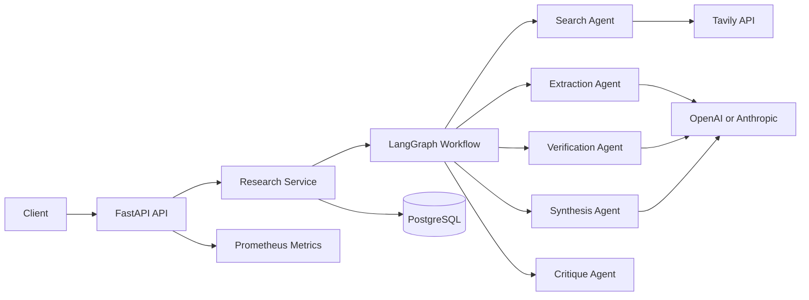

# Multi-Agent Research Orchestrator

[](https://github.com/Sneh30/multi-agent-research-orchestrator/actions/workflows/ci.yml)
[](https://www.python.org/downloads/)
[](LICENSE)
[](https://fastapi.tiangolo.com/)
[](https://langchain-ai.github.io/langgraph/)

> Production-grade AI research orchestration system that coordinates specialized LangGraph agents to produce verified research reports with citations, source tracking, confidence scoring, and structured output.

---

## Table of Contents

- [Overview](#overview)
- [Features](#features)
- [Architecture](#architecture)
- [Quick Start](#quick-start)
- [API Reference](#api-reference)
- [Project Structure](#project-structure)
- [Development](#development)
- [Testing](#testing)
- [Deployment](#deployment)
- [Documentation](#documentation)
- [Contributing](#contributing)
- [License](#license)

---

## Overview

Complex research questions often require dozens of source checks, cross-source verification, and careful synthesis. A single LLM pass is brittle for that workflow because it compresses search, extraction, verification, and writing into one opaque step.

**Multi-Agent Research Orchestrator** decomposes research into a LangGraph workflow with specialized agents:

| Agent | Responsibility |
|-------|----------------|
| **Search Agent** | Builds search strategies and retrieves sources via Tavily API |
| **Extraction Agent** | Extracts atomic evidence claims from retrieved sources |
| **Verification Agent** | Validates claims, rejects weak evidence, calibrates confidence |
| **Synthesis Agent** | Produces final report with citations and structured output |
| **Critique Agent** | Stress-tests report, routes through another evidence loop if confidence is low |

**Target Users:** Founders, consultants, analysts, researchers, and journalists who need research that can survive scrutiny.

---

## Features

- **Multi-Agent Pipeline** — 5 specialized LangGraph agents working in concert
- **Source Verification** — Automatic credibility scoring and evidence validation
- **Confidence Scoring** — Quantified confidence based on source diversity and evidence strength
- **Citation Tracking** — Full source attribution with URLs and credibility metrics
- **Structured Output** — Both Markdown reports and JSON structured data
- **Async Execution** — Non-blocking research runs with status polling
- **REST API** — FastAPI with OpenAPI documentation
- **PostgreSQL Persistence** — Durable storage for runs, sources, evidence, and reports
- **Prometheus Metrics** — Built-in observability for production monitoring
- **Deterministic Mode** — Test-friendly mode that doesn't call external APIs
- **Docker Compose** — One-command local development stack

---

## Architecture



### Data Flow

1. **Client** sends research query via REST API
2. **Research Service** creates a run and initiates the LangGraph workflow
3. **Search Agent** retrieves relevant sources from Tavily
4. **Extraction Agent** extracts factual claims from each source
5. **Verification Agent** validates evidence and scores credibility
6. **Synthesis Agent** generates a citation-backed report
7. **Critique Agent** evaluates quality; loops back if confidence is below threshold
8. **Report** is persisted to PostgreSQL and returned to client

---

## Quick Start

### Prerequisites

- Python 3.11+
- Docker & Docker Compose
- API keys for OpenAI, Anthropic, and Tavily (optional — deterministic mode works without them)

### 1. Clone and Configure

```bash
git clone https://github.com/Sneh30/multi-agent-research-orchestrator.git
cd multi-agent-research-orchestrator

cp .env.example .env
# Optional: edit .env with real API keys for live search/LLM
# Works out of the box with LLM_PROVIDER=deterministic (no keys needed)
```

### 2. Start the Stack

```bash
docker compose up --build
```

### 3. Access the Application

- **Frontend UI:** http://localhost:8000/docs
- **Health Check:** http://localhost:8000/health

### 4. Create a Research Run

```bash
curl -X POST http://localhost:8000/v1/research-runs \
  -H "Content-Type: application/json" \
  -H "X-API-Key: local-dev-key" \
  -d '{
    "query": "What evidence supports enterprise adoption of AI agents in regulated industries?",
    "objective": "Produce a board-ready diligence memo.",
    "constraints": {"audience": "founders", "prefer_primary_sources": true},
    "depth": "advanced",
    "max_sources": 12,
    "min_confidence": 0.72,
    "execute_async": true
  }'
```

### 5. Get the Report

```bash
curl http://localhost:8000/v1/research-runs/{run_id}/report \
  -H "X-API-Key: local-dev-key"
```

---

## API Reference

### Endpoints

| Method | Endpoint | Description |
|--------|----------|-------------|
| `GET` | `/app` | Frontend UI (no auth required) |
| `GET` | `/health` | Health check |
| `POST` | `/v1/research-runs` | Create a new research run |
| `GET` | `/v1/research-runs` | List all research runs |
| `GET` | `/v1/research-runs/{id}` | Get a specific research run |
| `POST` | `/v1/research-runs/{id}/execute` | Execute a research run synchronously |
| `GET` | `/v1/research-runs/{id}/report` | Get the research report |
| `GET` | `/v1/research-runs/{id}/sources` | List sources for a run |
| `POST` | `/v1/evaluations/report` | Evaluate a report payload |
| `POST` | `/v1/evaluations/runs/{id}` | Evaluate a completed run |

### Authentication

All API endpoints require an API key via the `X-API-Key` header:

```bash
-H "X-API-Key: your-api-key"
```

Public endpoints (no auth required): `/app`, `/docs`, `/metrics`, `/openapi.json`

### Request Example

```json
{
  "query": "What are the risks of using vector databases in production?",
  "objective": "Identify technical and business risks for due diligence.",
  "constraints": {
    "audience": "technical founders",
    "prefer_primary_sources": true
  },
  "depth": "advanced",
  "max_sources": 15,
  "min_confidence": 0.8,
  "execute_async": true
}
```

### Response Example

```json
{
  "id": "550e8400-e29b-41d4-a716-446655440000",
  "status": "completed",
  "query": "What are the risks of using vector databases in production?",
  "confidence_score": 0.85,
  "created_at": "2024-01-15T10:30:00Z",
  "completed_at": "2024-01-15T10:31:25Z"
}
```

---

## Project Structure

```
multi-agent-research-orchestrator/
├── backend/
│   └── research_orchestrator/
│       ├── agents/          # LangGraph agents, prompts, tools, scoring
│       ├── api/             # FastAPI routes, schemas, dependencies
│       ├── core/            # Config, logging, security, exceptions
│       ├── database/        # SQLAlchemy models and repositories
│       ├── evaluation/      # Evaluation metrics and benchmarks
│       ├── services/        # Business logic and orchestration
│       └── main.py          # FastAPI application factory
├── frontend/
│   └── index.html           # Single-file dark-themed research UI
├── database/
│   └── migrations/          # PostgreSQL migration scripts
├── docs/                    # Comprehensive documentation
├── infrastructure/          # Monitoring and proxy config
├── tests/
│   ├── unit/                # Unit tests
│   ├── integration/         # Integration tests
│   └── e2e/                 # End-to-end contract tests
├── .env.example             # Environment template
├── docker-compose.yml       # Local development stack
├── Dockerfile               # Container build
├── pyproject.toml           # Python project config
├── CONTRIBUTING.md          # Contribution guidelines
├── LICENSE                  # MIT License
├── README.md                # This file
└── SECURITY.md              # Security policy
```

---

## Development

### Local Development (without Docker)

```bash
# Create virtual environment
python -m venv .venv
source .venv/bin/activate  # On Windows: .venv\Scripts\activate

# Install dependencies
pip install -e ".[dev]"

# Start PostgreSQL (or use Docker for just the database)
docker compose up postgres -d

# Set deterministic mode for testing
export LLM_PROVIDER=deterministic

# Run the API
uvicorn research_orchestrator.main:app --reload --app-dir backend
```

### Code Quality

```bash
# Linting
ruff check backend tests

# Type checking
mypy backend

# Formatting
ruff format backend tests

# Run all checks
ruff check backend tests && mypy backend && pytest
```

### Environment Variables

| Variable | Description | Default |
|----------|-------------|---------|
| `APP_ENV` | Environment (local/test/staging/production) | `local` |
| `LOG_LEVEL` | Logging level | `INFO` |
| `API_KEY` | API authentication key | `local-dev-key` |
| `DATABASE_URL` | PostgreSQL connection string | `postgresql+asyncpg://...` |
| `OPENAI_API_KEY` | OpenAI API key (optional in deterministic mode) | — |
| `ANTHROPIC_API_KEY` | Anthropic API key (optional in deterministic mode) | — |
| `TAVILY_API_KEY` | Tavily search API key (optional in deterministic mode) | — |
| `LLM_PROVIDER` | LLM provider (openai/anthropic/deterministic) | `openai` |
| `OPENAI_MODEL` | OpenAI model name | `gpt-4.1-mini` |
| `ANTHROPIC_MODEL` | Anthropic model name | `claude-3-5-sonnet-latest` |
| `MAX_GRAPH_ITERATIONS` | Max agent loop iterations | `3` |
| `DEFAULT_MAX_SOURCES` | Default max sources to retrieve | `12` |
| `DEFAULT_MIN_CONFIDENCE` | Default minimum confidence threshold | `0.72` |

---

## Testing

### Run All Tests

```bash
export LLM_PROVIDER=deterministic
pytest
```

### Run with Coverage

```bash
pytest --cov=research_orchestrator --cov-report=term-missing
```

### Test Categories

| Category | Location | Description |
|----------|----------|-------------|
| Unit | `tests/unit/` | Agent logic, scoring, evaluation metrics |
| Integration | `tests/integration/` | API endpoints with FastAPI TestClient |
| E2E | `tests/e2e/` | Research workflow contract tests |

### Test Architecture

The test suite uses a **deterministic provider pattern**:

- `DeterministicLLMProvider` — Echoes prompts instead of calling real APIs
- `FakeSearchTool` — Returns hardcoded source data
- `LLM_PROVIDER=deterministic` — Disables all external API calls

This allows the entire pipeline to run in CI without API keys.

---

## Deployment

### Docker Production Build

```bash
# Build production image
docker build -t research-orchestrator:latest .

# Run with environment variables
docker run -p 8000:8000 \
  -e DATABASE_URL=postgresql+asyncpg://... \
  -e OPENAI_API_KEY=... \
  -e API_KEY=your-secure-api-key \
  research-orchestrator:latest
```

### Environment-Specific Configuration

| Environment | `APP_ENV` | `LLM_PROVIDER` | Notes |
|-------------|-----------|-----------------|-------|
| Local Dev | `local` | `openai` or `deterministic` | Docker Compose |
| Testing | `test` | `deterministic` | CI pipeline |
| Staging | `staging` | `openai` or `anthropic` | Cloud deployment |
| Production | `production` | `openai` or `anthropic` | Hardened config |

### Production Checklist

- [ ] Rotate all API keys
- [ ] Use strong `API_KEY` (not `local-dev-key`)
- [ ] Configure CORS for your domain
- [ ] Enable HTTPS
- [ ] Set up database backups
- [ ] Configure Prometheus monitoring
- [ ] Set appropriate `LOG_LEVEL` (INFO or WARNING)
- [ ] Review rate limits

---

## Documentation

| Document | Description |
|----------|-------------|
| [Product Foundation](docs/product-foundation.md) | Product requirements and goals |
| [Architecture](docs/architecture.md) | System design and data flow |
| [API Design](docs/api-design.md) | API specification and examples |
| [Database Design](docs/database-design.md) | Schema and data models |
| [LangGraph Design](docs/langgraph-design.md) | Agent workflow design |
| [AI Layer](docs/ai-layer.md) | LLM integration details |
| [Testing](docs/testing.md) | Testing strategy and guidelines |
| [Infrastructure](docs/infrastructure.md) | Deployment and monitoring |
| [Installation Guide](docs/installation-guide.md) | Detailed setup instructions |
| [Developer Guide](docs/developer-guide.md) | Development workflow |
| [User Guide](docs/user-guide.md) | End-user documentation |
| [API Documentation](docs/api-documentation.md) | Complete API reference |

---

## Contributing

We welcome contributions! Please see our [Contributing Guidelines](CONTRIBUTING.md) for details.

### Quick Start for Contributors

1. Fork the repository
2. Create a feature branch: `git checkout -b feature/amazing-feature`
3. Make your changes
4. Run tests: `pytest`
5. Run linting: `ruff check backend tests`
6. Commit: `git commit -m "feat: add amazing feature"`
7. Push: `git push origin feature/amazing-feature`
8. Open a Pull Request

---

## License

This project is licensed under the MIT License — see the [LICENSE](LICENSE) file for details.

---

## Acknowledgments

- [LangChain](https://langchain.com/) — LLM application framework
- [LangGraph](https://langchain-ai.github.io/langgraph/) — Agent orchestration
- [FastAPI](https://fastapi.tiangolo.com/) — Modern Python web framework
- [Tavily](https://tavily.com/) — Search API for AI agents
- [PostgreSQL](https://www.postgresql.org/) — Reliable open-source database
- [Prometheus](https://prometheus.io/) — Monitoring and alerting

---

<p align="center">Built with care for production-grade AI systems</p>
